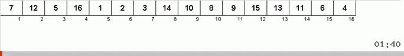

# Shell sort

 

Сортировка Шелла - это модифицированная сортировка простыми вставками.

Сортировка Шелла примерно так же получается из сортировки вставками, как пузырьковая
сортировка трансформируется в сортировку расчёской.

| Complexity | Big O        |
| ---------- | ------------ |
| Average    | θ(n × log n) |
| Best       | Ω(n × log n) |
| Worst      | O(n^2)       |
| Space      | O(1)         |
