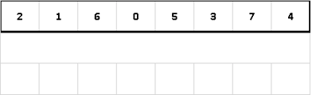

# Merge sort

 

Парадигма "разделя и властвуй" (divide and conqueror)

Эффективный алгоритм сортировки предложенный легендарным Джоном фон Нейманом в
1945 году. Сортировка была придумана во время работы над "Манхеттенским проектом"
как средство обработки больших массивов статистических данных.

Разделение: массив разбивается на два подмассива. Упорядочивание: подмассивы
сортируются (к ним рекурсивно применяется сортировка слиянием). Слияние:
упорядоченные подмассивы объединяются в один отсортированный массив.

| Complexity | Big o        |
| ---------- | ------------ |
| Average    | θ(n × log n) |
| Best       | Ω(n × log n) |
| Worst      | O(n × log n) |
| Space      | O(n)         |
