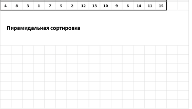

# Heap sort (Pyramid sort)

 

| Complexity         | Big O          |
| ------------------ | -------------- |
| Average Complexity | θ(n \* log(n)) |
| Best Case          | Ω(n \* log(n)) |
| Worst Case         | O(n \* log(n)) |
| Space Complexity   | O(1)           |

## Описание

Основная идея - ищем максимальный элемент в неотсортированной части массива и ставим
его в конец этого подмассива. В поисках максимума подмассив перестраивается в так
называемое сортирующее дерево (она же двоичная куча, она же пирамида), в результате
чего максимум сам "всплывает" в начало массива. После этого перемещаем максимум в
конец подмассива. Затем над оставшейся частью массива снова осуществляется процедура
перестройки в сортирующее дерево с последующим перемещением максимума в конец подмассива.

Сортирующее (неубывающее) дерево - дерево у которого любой родитель не меньше чем
каждый из его потомков. Если сортирующее дерево невозрастающее, то, соответственно,
любой родитель не больше чем каждый из его потомков.

У алгоритма нет благоприятных и вырожденных случаев. При любом входящем массиве
(даже если он почти отсортирован) сортировка имеет одну и ту же временную
сложность - O(n log n).

Сортировка кучей используется в целом ряде других алгоритмов сортировок.

-   Тернарная пирамидальная сортировка
-   Сортировка декартовым деревом
-   Плавная сортировка
