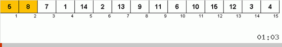

# Gnome sort

 

Схожа с сортировкой вставками.

Гномья сортировка это оптимизированная глупая сортировка. В глупой сортировке при нахождении неотсортированной пары соседей происходит обмен и возврат в начало массива. В гномьей сортировке просто делается один шаг назад.

Также алгоритм интересен тем, что используется всего лишь один цикл, что для алгоритмов сортировок большая редкость.

| Complexity | Big O  |
| ---------- | ------ |
| Average    | θ(n^2) |
| Best       | Ω(n)   |
| Worst      | O(n^2) |
| Space      | O(1)   |
