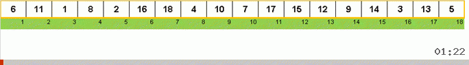

# Quick sort

 

Парадигма "разделя и властвуй" (divide and conqueror)

Простой в реализации и очень быстрый способ. Считается эталоном скорости для
алгоритмов сортировки. Когда заходит о временной сложности какого-либо эффективного
метода сортировки, то обычно его сравнивают именно с Quick sort.

| Complexity | Big O        |
| ---------- | ------------ |
| Average    | θ(n × log n) |
| Best       | Ω(n × log n) |
| Worst      | O(n ^ 2)     |
| Space      | O(n)         |

## Алгоритм

1. Выбирается опорный элемент (например, посередине массива).
1. Массив просматривается слева-направо и производится поиск ближайшего элемента,
   больший чем опорный.
1. Массив просматривается справа-налево и производится поиск ближайшего элемента,
   меньший чем опорный.
1. Найденные элементы меняются местами.
1. Продолжается одновременный двухсторонний просмотр по массиву с последующими
   обменами в соответствии с пунктами 2-4.
1. В конце концов, просмотры слева-направо и справа-налево сходятся в одной точке,
   которая делит массив на два подмассива.
1. К каждому из двух подмассивов рекурсивно применяется "Быстрая сортировка".
