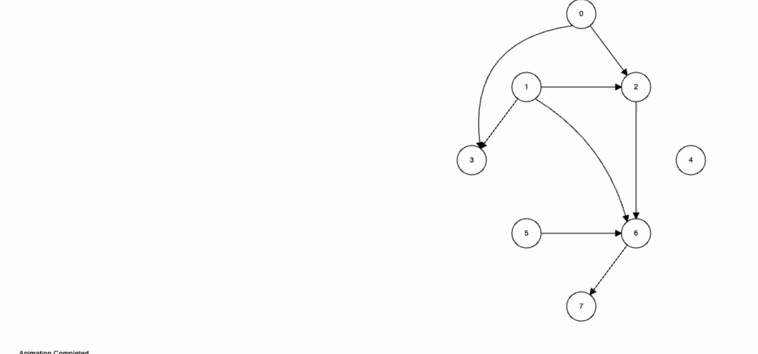

# Topological sort (DFS)

Алгоритм работает следующим образом метод DFS:

1. Создаются две структуры данных: `visited` для отслеживания посещенных вершин и
   `result` для хранения отсортированных вершин.
1. Инициализируется `visited` как пустой объект, где ключи - это вершины, а значения -
   это булевы значения, указывающие, была ли посещена вершина.
1. Запускается DFS для каждой непосещенной вершины в графе.
1. В процессе DFS, после посещения всех соседей вершины, вершина добавляется в начало
   `result`.
1. В конце работы алгоритма `result` содержит вершины в топологическом порядке.
