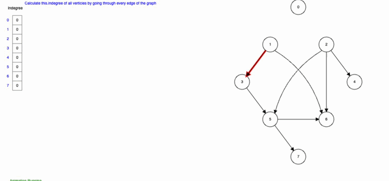

# Topological sort by indegree

Алгоритм работает следующим образом метод Indegree:

1. Вычислите входящую степень (количество входящих ребер) для каждой вершины.
1. Поместите все вершины с входящей степенью 0 в очередь.
1. Извлеките вершину из очереди, уменьшите входящую степень всех ее соседей на
    1. Если входящая степень соседа становится 0, добавьте его в очередь.
1. Повторяйте шаги 3, пока очередь не опустеет.
1. Если все вершины были извлечены из очереди и добавлены в порядок сортировки,
   то граф является DAG, и мы получили топологическую сортировку. В противном
   случае, граф содержит циклы, и топологическая сортировка невозможна.
